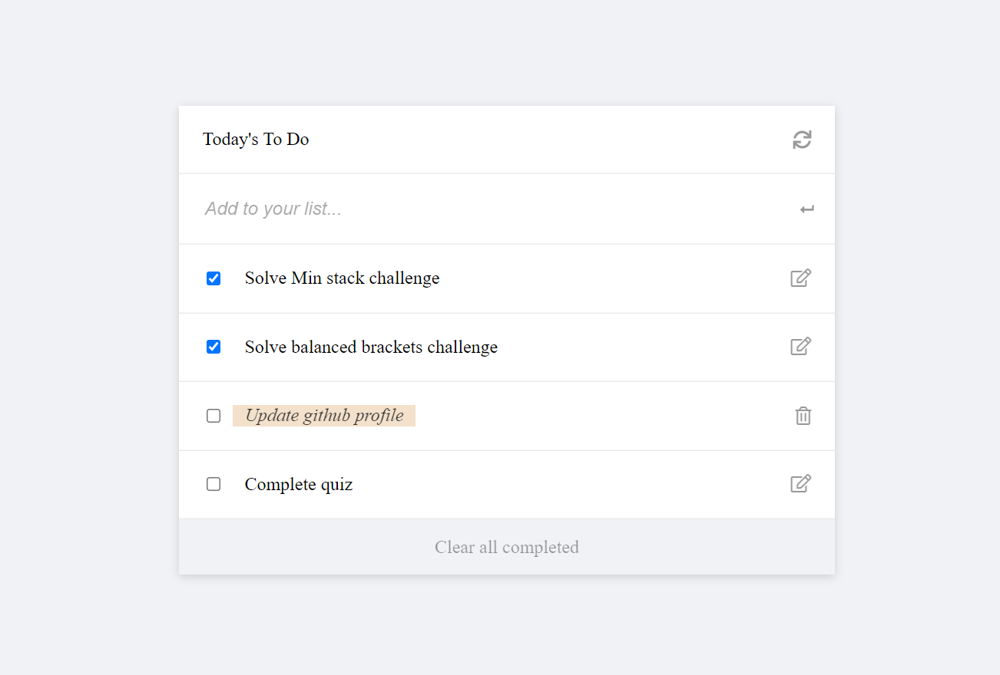

# To-Do list
> This is a simple To-Do list website that allows users to add new tasks, mark completed tasks, edit existing tasks, remove tasks and clear all completed tasks.

## Built With

- HTML
- CSS
- JavaScript(ES6)
- Webpack
- Jest Library

## Live demo

[Live demo link](https://zeenatlawal.github.io/To-Do-list/dist/)

## Getting Started

### To get a local copy run the following steps:

- [Copy this link](https://github.com/ZeenatLawal/To-Do-list.git)
- Open your terminal or command line
- Run `git clone` and paste the link
- Open the folder with your code editor
- Create a branch to work on
- Run `npm install`
- Run `npm run build`
- Run `npm run start` to launch the server.
- Run `npm run test` to run the test cases.

## Author 1

👤 **Zeenat Lawal**

- GitHub: [@ZeenatLawal](https://github.com/ZeenatLawal)
- Twitter: [@lawal_zeenat](https://twitter.com/lawal_zeenat)
- LinkedIn: [Zeenat Lawal](https://www.linkedin.com/in/zeenatlawal/)

## Author 2

👤 **Adedamola Shittu**

- GitHub: [@dammyShittu](https://github.com/DammyShittu/)
- Twitter: [@aded_shittu](https://twitter.com/aded_shittu/)
- LinkedIn: [Adedamola Shittu](linkedin.com/in/adedamola-shittu-3ab465172/)

## 🤝 Contributing

Contributions, issues, and feature requests are welcome!

Feel free to check the [issues page](https://github.com/ZeenatLawal/To-Do-list/issues).

## Show your support

Give a ⭐️ if you like this project!

## Acknowledgments

- Learning partners, Standup and morning session team
